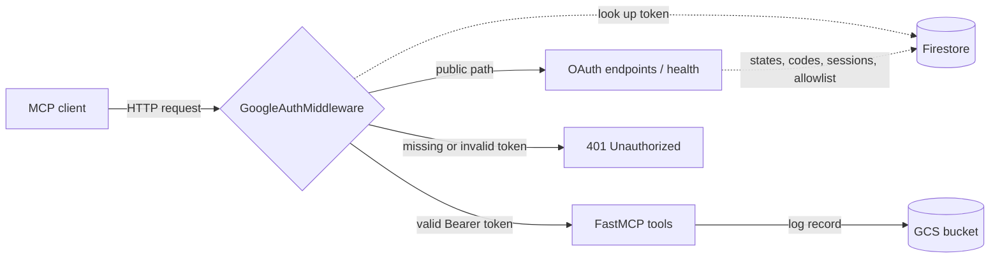
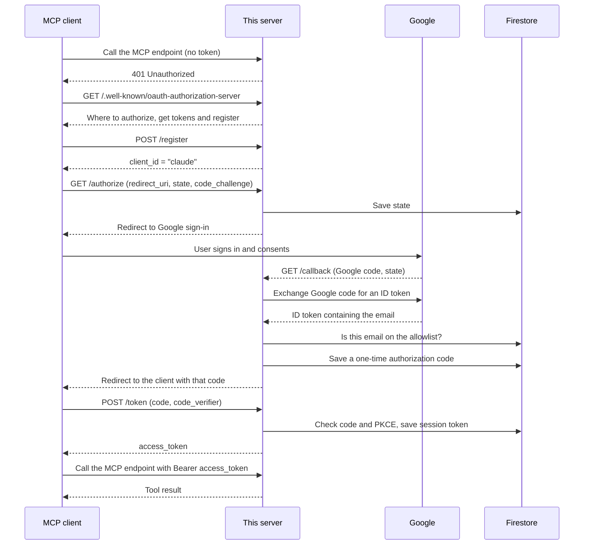

# proyecto-test-mcp

A small, remote **MCP server** written in Python. It exposes two demo tools, protects them with **Google sign-in**, only lets in users on an **allowlist**, and records every tool call in **Google Cloud Storage**. It is packaged with Docker and meant to run on **Cloud Run**.

The tools themselves are deliberately trivial (one reverses a string, the other lowercases it). The interesting part is everything around them: this repository is a template for a remote MCP server with real authentication and usage tracking, which you can reuse by swapping in your own tools.

## Contents

1. [What is MCP, in one paragraph](#what-is-mcp-in-one-paragraph)
2. [What this server does](#what-this-server-does)
3. [Project structure](#project-structure)
4. [How a request travels through the server](#how-a-request-travels-through-the-server)
5. [The login flow, step by step](#the-login-flow-step-by-step)
6. [Usage tracking](#usage-tracking)
7. [Cloud resources you need](#cloud-resources-you-need)
8. [Running it locally](#running-it-locally)
9. [Deploying](#deploying)
10. [Connecting an MCP client](#connecting-an-mcp-client)
11. [Adding your own tool](#adding-your-own-tool)
12. [Known limitations](#known-limitations)

## What is MCP, in one paragraph

The **Model Context Protocol** (MCP) is a standard way for an AI assistant (the *client*, for example Claude) to call functions that live in another program (the *server*). The server publishes a list of **tools**, each with a name, a description and typed parameters. The assistant reads that list and decides when to call a tool. A *remote* MCP server, like this one, is reached over HTTP, so it needs what any web API needs: a URL, authentication and logging.

## What this server does

| Feature | How it is done | Where |
| --- | --- | --- |
| Exposes tools over HTTP | [FastMCP](https://gofastmcp.com) with the Streamable HTTP transport | [mcp/main.py](mcp/main.py) |
| Authenticates users | OAuth 2.0 authorization-code flow with PKCE, delegating the actual login to Google | [mcp/oauth_google.py](mcp/oauth_google.py) |
| Restricts access | Email allowlist stored in Firestore | [mcp/oauth_google.py](mcp/oauth_google.py) |
| Guards every request | ASGI middleware that checks the `Authorization: Bearer` token | [mcp/middleware_google.py](mcp/middleware_google.py) |
| Tracks usage | One JSON file per tool call, written to a GCS bucket | [mcp/tool_context.py](mcp/tool_context.py), [mcp/utils.py](mcp/utils.py) |
| Ships to production | Docker image deployed to Cloud Run by GitHub Actions | [mcp/Dockerfile](mcp/Dockerfile), [deploy.yml](deploy.yml), [deploy_dev.yml](deploy_dev.yml) |

## Project structure

```
.
├── deploy.yml               # GitHub Actions workflow: push to main -> production
├── deploy_dev.yml           # GitHub Actions workflow: push to dev  -> development
└── mcp/
    ├── main.py              # Entry point: defines the tools, wires routes, starts the server
    ├── middleware_google.py # Gatekeeper: rejects requests without a valid session token
    ├── oauth_google.py      # The OAuth endpoints (/authorize, /callback, /token, ...)
    ├── request_context.py   # A ContextVar that holds "who is the current user"
    ├── tool_context.py      # Context manager that logs each tool call
    ├── utils.py             # Helper that uploads a JSON document to GCS
    ├── requirements.txt     # Python dependencies (pinned)
    └── Dockerfile           # Container image definition
```

### A closer look at each file

**[mcp/main.py](mcp/main.py)** is the entry point. It does three things:

1. Creates the FastMCP server and registers `tool_1` and `tool_2` with the `@mcp.tool()` decorator. The function's docstring becomes the description the AI assistant sees, and the type hints become the tool's parameter schema.
2. Takes the web application FastMCP generates and appends extra HTTP routes to it: a `/health` check and the OAuth endpoints.
3. Wraps the whole application in `GoogleAuthMiddleware` and starts it with Uvicorn on the port given by the `PORT` environment variable (8080 by default).

**[mcp/middleware_google.py](mcp/middleware_google.py)** runs before every HTTP request. Paths needed to log in (`/authorize`, `/callback`, `/token`, `/register`, the `/.well-known/...` documents) and `/health` are public. Everything else, including the MCP endpoint itself, requires an `Authorization: Bearer <token>` header. The middleware looks the token up in Firestore; if it exists, it stores the user's email in `current_user` and lets the request through. Otherwise it answers `401`.

**[mcp/oauth_google.py](mcp/oauth_google.py)** makes this server its own small OAuth *authorization server*. MCP clients expect to talk to the server they are connecting to, not directly to Google, so this file sits in the middle: it receives the client's OAuth request, sends the user to Google to sign in, and then issues its own token. The flow is explained [below](#the-login-flow-step-by-step).

**[mcp/request_context.py](mcp/request_context.py)** is two lines, but an important two. A `ContextVar` is a variable whose value is private to each in-flight request, so concurrent requests from different users do not overwrite each other. The middleware writes the email into it; the logging code reads it back.

**[mcp/tool_context.py](mcp/tool_context.py)** provides `tool_context`, an `async with` block that wraps a tool's body. It measures how long the body took, captures the result or the exception, and writes a log record. It discovers the tool's name automatically by inspecting the call stack, so you never pass it in.

**[mcp/utils.py](mcp/utils.py)** contains `save_json_to_gcs`, which uploads a dictionary as a JSON file to the tracking bucket.

## How a request travels through the server



The middleware is the single entry point. Nothing reaches a tool without passing through it.

## The login flow, step by step

There are three parties: the **MCP client** (for example Claude), **this server**, and **Google**. The server plays two roles at once: it is an OAuth *server* towards the client and an OAuth *client* towards Google.



Some of the terms above:

- **Discovery** (`/.well-known/...`): JSON documents that tell the client which URLs to use. This is how a client can connect knowing nothing but the server's base URL.
- **Dynamic client registration** (`/register`): the client introduces itself. This server does not keep a registry; it answers every registration with the same fixed `client_id`, `"claude"`.
- **`state`**: a random value the client generates. The server stores the client's request under it in Firestore so it can pick the flow back up when Google redirects to `/callback`.
- **PKCE** (`code_challenge` / `code_verifier`): the client sends a hash at the start and the original secret at the end. The server recomputes the SHA-256 hash and compares. This proves that whoever redeems the code is the same client that started the flow.
- **Allowlist**: after Google confirms the email, the server checks it against a list in Firestore. Users who are not on it are sent back to the client with `error=access_denied` and never receive a token.
- **Session token**: the `access_token` the client finally receives is a random string generated by this server, not a Google token. Firestore maps it to the user's email.

Only the `openid` and `email` scopes are requested from Google. The server uses Google to learn who the user is and nothing else.

## Usage tracking

Every tool wraps its work in `tool_context`:

```python
@mcp.tool()
async def tool_1(input: str) -> dict:
    """Entrega una transformación a tu input"""

    async with tool_context(SERVICE_NAME, {"input": input}) as ctx:
        ctx.result = f"Esta es la transformación a tu input: {input[::-1]}"

    return {"result": ctx.result}
```

When the block ends, successfully or with an exception, a JSON record is uploaded to the `mcp_tracking_private` bucket:

```json
{
  "mcp": "proyecto-test-mcp",
  "tool": "tool_1",
  "user": "someone@example.com",
  "latency": 0.0003,
  "date": {"year": 2026, "month": 10, "day": 2, "hour": 14, "min": 5, "sec": 9},
  "input": {"input": "Hello"},
  "output": "Esta es la transformación a tu input: olleH",
  "error": "None"
}
```

On failure, `output` is `"None"`, `error` holds the exception message, and the exception is re-raised so FastMCP reports it to the client.

Files are stored under a partitioned path:

```
gs://mcp_tracking_private/year=2026/month=10/day=2/hour=14/mcp=proyecto-test-mcp/tool=tool_1/data_20261002_170509.json
```

The `key=value` folder layout is the Hive partitioning convention, which lets BigQuery (as an external table) and similar engines filter by date, server or tool without reading every file. The folder date is in `America/Santiago` time, while the timestamp in the file name is in UTC.

## Cloud resources you need

The code has these names hard-coded, so they must exist (or you must change the constants):

| Resource | Name | Used for |
| --- | --- | --- |
| Firestore database | `mcp-proyecto-test-mcp` in project `dm-agents-private` | OAuth state and sessions, allowlist |
| GCS bucket | `mcp_tracking_private` in project `dm-agents-private` | Tool-call logs |
| Google OAuth client (type "Web application") | any | Google sign-in |
| Artifact Registry repository | `proyecto-test-mcp` in project `dm-agents`, region `us-central1` | Docker images |
| Service account | `proyecto-test-mcp@dm-agents.iam.gserviceaccount.com` | Identity of the Cloud Run service |

Note that the service runs in `dm-agents` but its data lives in `dm-agents-private`, so the service account needs permission in the second project to read and write the Firestore database and to create objects in the bucket.

### Firestore collections

| Collection | Document ID | Content | Lifetime |
| --- | --- | --- | --- |
| `config` | `mcp-proyecto-test-mcp` | `allowed`: array of permitted emails | You maintain it by hand |
| `oauth_states` | the `state` value | The client's pending authorization request | Deleted after a successful callback |
| `oauth_codes` | the authorization code | Email plus PKCE challenge | Deleted when exchanged for a token |
| `session_tokens` | the access token | `email` | Never deleted |

**To grant someone access**, add their email to the `allowed` array of the `config/mcp-proyecto-test-mcp` document. If that document does not exist, nobody can log in.

### Google OAuth client

In the Google Cloud console, add `<BASE_URL>/callback` as an **Authorized redirect URI** of the OAuth client. It must match exactly, or Google will refuse the sign-in.

### Environment variables

| Variable | Required | Description |
| --- | --- | --- |
| `BASE_URL` | yes | Public URL of this server, without a trailing slash. Used to build the discovery documents and the Google redirect URI. |
| `GOOGLE_WEB_CLIENT_ID` | yes | Client ID of the Google OAuth client |
| `GOOGLE_WEB_CLIENT_SECRET` | yes | Client secret of the Google OAuth client |
| `PORT` | no | Port to listen on. Defaults to `8080`. |

The server will not start without the three required variables: they are read at import time.

## Running it locally

You need Python 3.11 and Google Cloud credentials with access to the Firestore database and the bucket.

```bash
cd mcp
python -m venv .venv && source .venv/bin/activate
pip install -r requirements.txt

gcloud auth application-default login

export BASE_URL="http://localhost:8080"
export GOOGLE_WEB_CLIENT_ID="..."
export GOOGLE_WEB_CLIENT_SECRET="..."

python main.py
```

Check that it is up:

```bash
curl http://localhost:8080/health
# {"status":"ok"}
```

For the Google login to work locally, `http://localhost:8080/callback` must be registered as a redirect URI in the OAuth client.

To run it in Docker instead:

```bash
docker build -t proyecto-test-mcp mcp/
docker run -p 8080:8080 \
  -e BASE_URL -e GOOGLE_WEB_CLIENT_ID -e GOOGLE_WEB_CLIENT_SECRET \
  -v "$HOME/.config/gcloud/application_default_credentials.json:/creds.json:ro" \
  -e GOOGLE_APPLICATION_CREDENTIALS=/creds.json \
  proyecto-test-mcp
```

## Deploying

Two GitHub Actions workflows do the same job for two environments:

| Workflow | Trigger | Cloud Run service | Image |
| --- | --- | --- | --- |
| [deploy.yml](deploy.yml) | push to `main` | `mcp-proyecto-test-mcp` | `mcp-proyecto-test-mcp` |
| [deploy_dev.yml](deploy_dev.yml) | push to `dev` | `mcp-proyecto-test-mcp-dev` | `mcp-proyecto-test-mcp-dev` |

Each one authenticates to Google Cloud, builds the image from [mcp/Dockerfile](mcp/Dockerfile), pushes it to Artifact Registry tagged with the commit SHA and `latest`, and deploys it to Cloud Run in `us-central1` with 1 GiB of memory and a 900-second timeout.

The service is deployed with `--allow-unauthenticated`. That is intentional: Cloud Run lets every request in, and the application's own middleware decides who is authorized.

> **These workflows are not active yet.** GitHub only runs workflows located in `.github/workflows/`, and both files currently sit at the repository root. Move them there to enable automatic deployment.

Repository secrets required:

| Secret | Description |
| --- | --- |
| `GCP_SA_KEY` | JSON key of a service account allowed to push images and deploy to Cloud Run |
| `GOOGLE_WEB_CLIENT_ID` | Passed to the service as an environment variable |
| `GOOGLE_WEB_CLIENT_SECRET` | Passed to the service as an environment variable |

## Connecting an MCP client

Add the server to your MCP client as a remote (custom) connector, using the service URL followed by FastMCP's default path, `/mcp`:

```
https://<your-cloud-run-url>/mcp
```

The first time, the client opens a browser window for the Google sign-in. If your email is on the allowlist, the connection completes and `tool_1` and `tool_2` become available.

## Adding your own tool

Add a function to [mcp/main.py](mcp/main.py) following the same pattern:

```python
@mcp.tool()
async def count_words(text: str) -> dict:
    """Counts the words in a text."""

    async with tool_context(SERVICE_NAME, {"text": text}) as ctx:
        ctx.result = len(text.split())

    return {"result": ctx.result}
```

Three rules to keep the tracking correct:

1. Call `tool_context` **directly** inside the tool function. It reads the tool name from the call stack, so calling it from a helper would log the helper's name.
2. Pass every input you want recorded in the dictionary.
3. Assign the output to `ctx.result` **inside** the block; the log is written when the block ends.

Write a clear docstring: it is what the AI assistant reads to decide when to use the tool.

If the new tool needs another module, remember to add a `COPY` line for it in [mcp/Dockerfile](mcp/Dockerfile), which copies files one by one.

## Known limitations

This is a working template, not a hardened product. Things to be aware of before using it for anything sensitive:

- **Sessions never expire.** Session tokens stay valid until someone deletes them from Firestore, and there is no refresh-token flow. Removing a user from the allowlist blocks future logins but does not revoke a token they already hold.
- **Abandoned logins leave data behind.** `oauth_states` and `oauth_codes` documents are only deleted on the success path, and codes have no expiry time. A Firestore TTL policy would fix both.
- **`redirect_uri` is not validated.** `/authorize` accepts any redirect URI and `/register` does not store clients, so the server cannot check that a redirect target belongs to a known client.
- **The Google ID token's signature is not verified.** The email is read by decoding the token payload. The token comes straight from Google over HTTPS, which limits the risk, but verifying it with `google-auth` (already in the requirements) would be stricter.
- **Dev and prod share data.** Both environments use the same Firestore database, allowlist and bucket, because those names are constants in the code rather than configuration.
- **Logging is synchronous and in the request path.** Each tool call waits for the GCS upload, and a failed upload makes the tool call fail.
- **Log files can collide.** File names have one-second resolution, so two calls to the same tool within the same second overwrite each other.
- **Some declared dependencies and imports are unused**, such as `requests` and `google-cloud-secret-manager` in [mcp/requirements.txt](mcp/requirements.txt).
